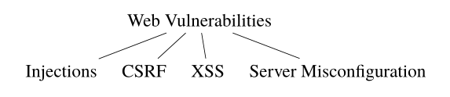
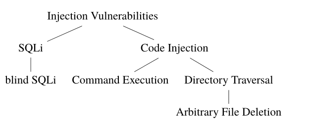
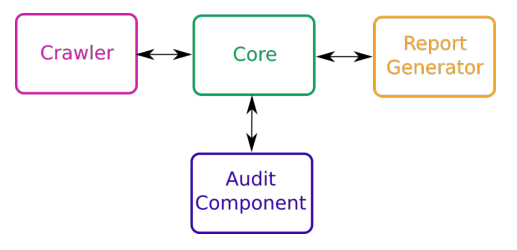
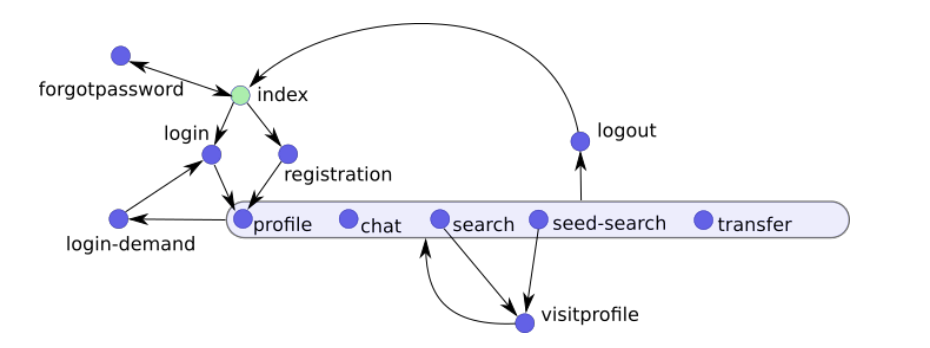
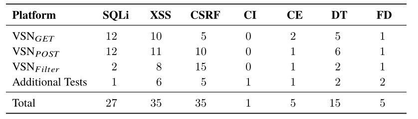

# 1 introduction

web漏洞扫描器（WVSs）很难处理动态和交互式内容。尤其是Flash和复杂的Javascript程序被发现阻碍了扫描仪的运行。

# 3 Web Vulnerabilities

## 3.2 Web Vulnerabilities

### 3.2.1 Injection Vulnerabilities

当攻击者能够通过未经充分消毒的用户输入将恶意代码包含到最终执行的现有脚本中时，就会存在注入漏洞 。

# 4 Web Vulnerability Scanners

## 4.1 Black-Box Scanners

广泛采用的黑盒漏洞扫描器的结构：

web漏洞扫描器的通用架构依赖于这样一种想法，即我们可以将测试web应用程序安全性的复杂任务划分为许多的子任务。

核心组件  监控和协调实际执行安全测试的其他模块的活动。

**Core Component and Configuration**

web漏洞扫描器的核心组件用于协调其他的组件和监控扫描。

此外，web应用扫描器经常也会提供许多的配置功能（例如测试人员可以启动或禁用对特定漏洞的搜索）。

==web漏洞扫描器也提供了一种阻止扫描器执行不需要操作的方法（例如状态更改操作，如注销或者删除用户等功能）。这可以防止触发危及扫描的操作。==

==自动建立和维护有效的会话==也是web扫描器的另一个中心主题。研究中遇到了以下的身份验证方法：

- 表单身份验证：要求测试人员指定登录表单的确切位置和内容。此外，如果扫描器经过身份验证，用户需要指定响应中出现的URL和相应的子字符串。第二个输入是必要的，以确保扫描仪在测试期间不会退出会话 
- HTTP身份验证：在HTTP请求头中提交用户名和密码。
- NTLM身份验证：通过Microsoft的NTML协议来提供身份验证。
- Login Sequence Records：Acunetix中专有的技术，用于记录手动登录并指定干预点。登录序列记录器（LSR）会在记录期间自动检测会话验证模式。此外，用户可以指定不需要的操作通过首先执行然后在上下文菜单中标记它们。

**Crawling Component**

爬虫一方面跟踪静态链接另一方面也浏览动态创建的URL。动态URL很具有挑战性，并且研究表明，现代的web应用程序中的大多数URL都是使用Javascript动态生成的。此外Flash和ajax等其他动态技术的推广也带来了新的爬虫挑战。

web应用程序的状态完整性也是爬虫需要考虑的，这个问题即签名提到的身份验证问题的一般化。

因此可以区分两种爬取方法：

1. 基于文本，在响应中搜索URL。
2. 借助浏览器组件执行客户端的脚本和触发各种事件来帮助爬虫组件。

**Audit Component**

Audit模块实现了一个单独的评估功能，该功能用于判断扫描器是否充分确信存在漏洞。许多的web应用扫描器主要使用2个不同的方法来计算置信值：

1. 差异分析，比较安全输入的响应和恶意输入的响应。
2. 时间分析：注入导致程序执行延时的代码，以检测延时。

由于扫描器对底层程序逻辑信息的缺乏，黑盒扫描器can never make irrevocable statements.（这是什么意思？？？）

**Report Component**

报告可能会包括修复安全问题和漏洞位置的提示。除了总体的信息（如安全性的评估和发现漏洞数量的统计），报告可能还会包括每个不同漏洞以下信息：

- 符合CWE或一个类似分类的标识。
- 严重程序，作为潜在影响的评估。
- 漏洞位置，文件名可能还带上行号。
- 成功利用该漏洞的请求（作为存在的证明）。
- 关于预防机制的提示。
- 关于漏洞的进一步参考文献

**Black-Box Vulnerability Scanner Implementations**

Acunetix、AppScan、Netsparker、WebInspect、Burp Suite、w3af、ZAP、Arachni。

## 4.2 White-Box Scanners

white-box scanners take a diametral point of view compared to black-box scanners.（这又是啥意思。。。）

Antunes等人根据  关于对指令之间依赖关系建模的精确性的复杂程度来区分白盒扫描器（这句子有点抽象）。根据他们的说法有些扫描器将自己限制在了单独的一行代码之中，有的扫描器考虑了指令之间的依赖关系。

复杂性也是限制白盒扫描仪的一个重要因素。与黑盒扫描仪相比，这种复杂性表现在应用程序的源代码中，而不是其动态行为中。因为白盒扫描程序依赖于底层源代码的精确模型，所以它们专门用于PHP等单一脚本语言。因此，一个白盒扫描仪无法测试使用无法建模的技术的web应用程序。这可能是市场上黑盒扫描器优于白盒扫描器的原因之一。 

### 4.2.1 White-Box Vulnerability Scanner Implementations

Pixy，，适用于PHP的XSS检测工具：流敏感、面向过程的、上下文敏感的静态代码分析。

它们方法的基本思想是将用户的输入视为受污染的数据，在插入到敏感的执行点(sink)之前应该被消毒(sanitized)。（其实就是污点分析了）他们的工具通过跟踪受污染的变量和对这样变量执行的操作来检测是否可能发生未消毒的输入出现在了敏感的sink。

Medeiros等人提出了另外一种方法，它们将污点分析和数据挖掘的原理结合起来。污点分析用于检测可能将unsanitized的用户输入传递给漏洞的变量。此外，数据挖掘的的思想进一步的减少了误报(false positives)的数量。基于这种组合的方法，它们提出了一种通过更正源码中不安全的指令以实现自动化错误代码修正的想法（？？？）。

## 4.4 Limitations

之前的研究已经解决了黑盒扫描器的一些明显的局限性。

首先是现代web应用程序的状态完整性，Doupe等人原型化(prototyped)一个状态感知的黑盒扫描器，该扫描器通过观察web应用的响应来逐渐构建web应用状态的模型。关键思想是将web应用建模成一个连续构建的米利型有限状态机（mealy machine）。（？？？）

黑盒扫描器另一个局限性是它无法安全地判定一个漏洞是否存在。这是基于黑盒测试的内在限制。通过观测web应用程序的行为并对响应应用启发式(heuristics)，可以得出漏洞存在的结论。（这又是什么意思？？？）

此外，当前的WEB扫描器主要关注于在执行(implementation)过程中引进的web漏洞技术，像设计上或者程序逻辑的缺陷等漏洞则被忽略了。Doupe等人简要地解决了这个问题，由于没被测试的scanner能够检测出明显的逻辑缺陷在他们的WackoPicko web应用程序。（？？？）

这部分说的非常的抽象，没太懂是什么意思。？？？

# 5 Experimental Arrangement

## 5.1 Vulnerable Social Network

创建了一个易受攻击的web应用程序，称之为VSN。它的构造考虑了两个方面：

1. 挑战性的爬虫结构：这个应用旨在为爬虫造成一些挑战性的任务。
2. web应用程序逻辑的存在：去测试扫描器是否能够检测到需要理解应用程序逻辑的错误。

**VSN - Architecture and Functionalities**

主要就是VSN的结构，各个页面及其功能。

并且VSN还使用了javascript和jquery等技术来测试现代web应用程序扫描器的局限性，来说明是否web漏洞扫描器可以应对这些动态的技术。此外还包含基于事件处理的爬虫功能。

还实现了3个变体，VSNg、VSNp、VSNf。

VSNg主要是GET请求，和一些漏洞。

VSNp主要是POST请求，和一些漏洞。

VSNf实现了一些不充分的消毒和过滤功能。

## 5.2 Acunetix

Acunetix是一款具有黑盒和白盒特性的商业web应用扫描器。它还可以对其他的网络协议进行安全审计，如Telnet、SSH、FTP等。支持使用不同的用户代理进行爬行。还可以导出各种类型的扫描报告。可限制特定的漏洞类型（即选择特定的某个漏洞进行扫描）。可使用正则表达式让扫描器排除特定的路径。它通过其DeepScan技术来支持HTML5和AJAX爬行。关于身份验证，其支持HTTP-Authentication、NTLM-Authentication、Login Sequences （Acunetix）独有的。

此外，设置AcuSensor techology可以通过白盒的方法拓展黑盒方法（即灰盒，类似webfuzz）。它支持PHP、ASP.NET和Java。要激活这个功能需要在工程中包含一个含有AcuSensor instrumentation code的文件。之后它命令脚本解释器将AcuSensor代码添加到每一个服务端脚本中。因此AcuSensor可以将关于服务器状态的本地信息提供给黑盒扫描器。

有如下好处：

- 通过检测更大范围的漏洞来得到更好的漏洞覆盖率。
- 降低误报率和漏报率。
- 添加了明确判断漏洞是否存在的验证功能。
- 为开发者报告收集额外的信息，例如源代码中漏洞的位置等。
- 给扫描器提供本地文件列表以便于更进一步检查这些文件来检测隐藏参数的后端爬虫(Back-end crawling)。

## 5.3 Arachni

开源、免费，可部署在4种变体中：

- 通过命令行执行的快速扫描。
- 支持自定义扫描的Ruby库。
- 支持多用户、多扫描和多调度的Web用户界面。
- 可用于部署分布式系统的远程代理。

Arachni支持HTML5、AJAX、DOM和高级Javascript爬虫。它也支持移动应用程序。

## 5.4 w3af

还是w3af那几个模块和w3af的一些介绍。

# 6.Comparison of Web Vulnerability Scanners

## 6.1 Analysis of VSNg Test Results

pXSS(存储型XSS，persistent xss)对于自动化的scanner来说尤其难以检测。

CSRF，Acunetix和arachni对CSRF的搜索限制在了HTML形式，并不是Javascript事件和AJAX请求。

对于黑盒scanner来说，FD很难检测出来。它们无法收集web应用程序状态的信息，很难检测文件系统的更改。

## 6.2 Analysis of VSNp Test Results

VSNp除了更多的是POST，对于爬虫上也加大了难度，所以SQL等漏洞的检测的覆盖率低可能和爬虫有关。

DT和FD漏洞更多的认为是因为扫描器的审计方法不够充分，缺乏适当的启发式（启发式到底是啥意思呀）

## 6.3 Analysis of VSNf Test Results

XSS的低检测应该是因为爬虫没有爬取到相应的漏洞。

## 6.4 Analysis of Additional Tests

FD检测时w3af使得文件删除了它自己。Huang等人提出的副作用感知方法。（之后可以看一下），这也很重要，就是行为造成的副作用。

和爬虫能力有关。

## 6.5 Evaluation

扫描器的爬虫能力需要加强，javascript事件和ajax。

扫描器无法执行完全的fuzzing，因此遗漏一些没有被过滤器充分保护的漏洞。且由于效率的问题，scanner仅测试一组参数值，更多的可以通过灰盒技术来客服这一限制，而且要进一步的改进黑盒和白盒的集成。

WVS无法检测需要考虑web应用程序架构的漏洞。

# 7 Outlook

可拓展web漏洞扫描器的目标范围，如高级的网络扫描功能（扫描SSH、FTP、SOCKETS、Telnet等socket中的漏洞）。

web漏洞测试应该与开发过程更紧密的联系。==自动修复安全问题的web漏洞扫描器==将减少web应用程序开发的手工操作，也会降低开发和维护的成本。

# 8 Conclusion

像灰盒测试这样的新方法很有希望。

对于严重依赖像Javascript和AJAX这样的动态技术的网站时，目前的scanner有些力不从心。

得出结论，==Web漏洞扫描器非常适合想要测试静态的大规模web应用程序的安全专业人员，但是它们并不能取代手动的安全审计。==

