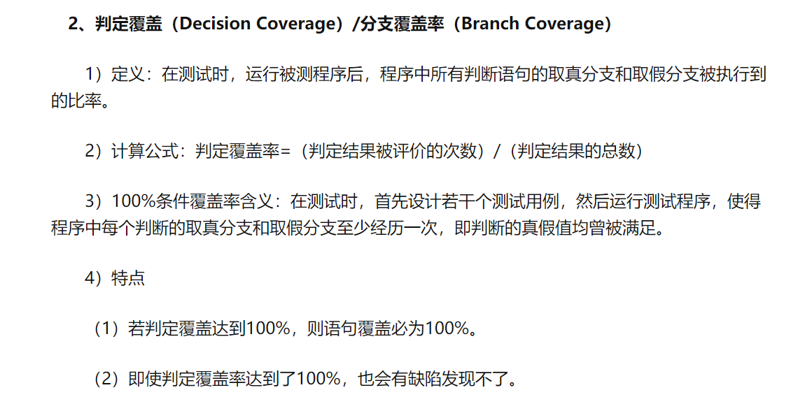
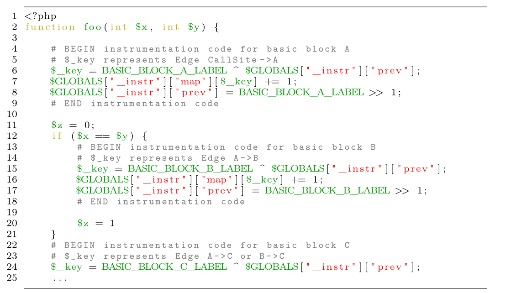
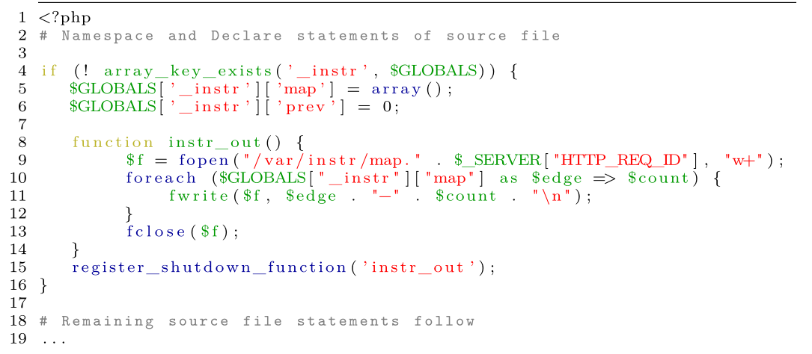
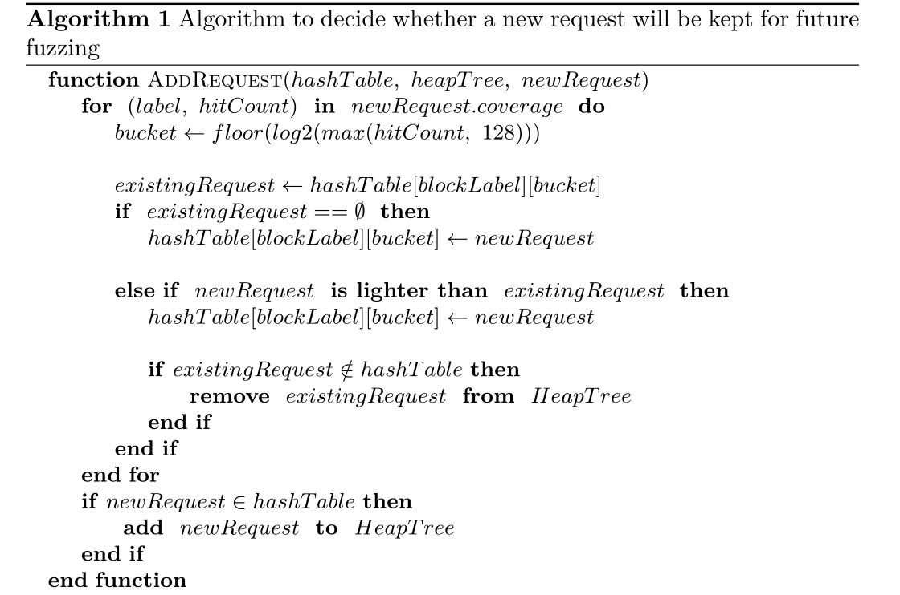
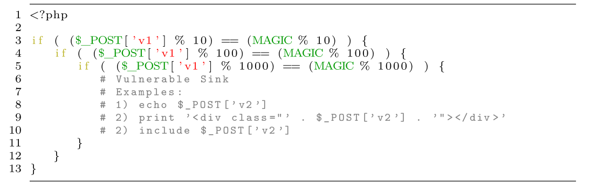
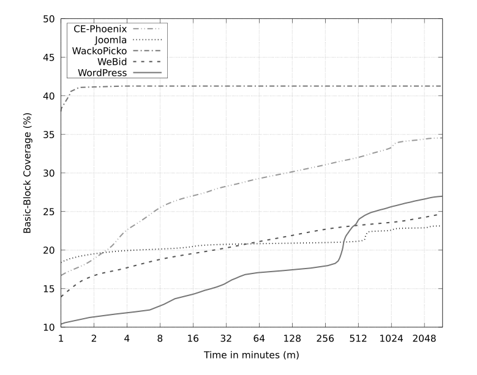

# README

## 疑问

什么是Instrumentation：

插桩。

更多的需要去学fuzz了。

code coverage是什么：

参考https://blog.csdn.net/quicknet/article/details/5549902

## 2 webFuzz

### 2.1 Instrumentation

#### Instrumentation level

basic block or branch coverage

Basic blocks are maximal sequences of consecu-tive statements that are always executed together

参考https://zhuanlan.zhihu.com/p/36416223

#### Coverage

In a Control Flow Graph (CFG), the basic blocks correspond to the nodes in the graph. 

控制流图参考：

https://blog.csdn.net/william_munch/article/details/85258893

https://www.cnblogs.com/lxh2cwl/p/14842908.html

其中边缘描绘了控制流路径，节点描绘了基本块，这些基本块是没有任何跳跃或分支的直线段。

Although expressions with logical operators can also be composed out of multiple basic blocks due to short-circuit evaluation, for the sake of performance webFuzz does not instrument them.

什么是short-circuit evaluation：

https://www.jianshu.com/p/d9cac08f89ed

Inspired by the I [43] method of providing edge coverage information,we have adapted a similar approach for web applications. 

AFL（https://afl-1.readthedocs.io/en/latest/about_afl.html）

The last statement in the stub code performs a right bitwise shifting on the current basic block label and stores the result as the label of the previously visited block. The shifting is needed to avoid cases where a label is XORed with itself thus giving zero as a result. This can happen for instance, with simple loops that do not contain control statements in their body

#### Feedback

 Coverage information is reported at the end of program execution

we prepend to every source file additional header stub code that will be the first statements executed in a program

### 2.2 Fuzzing Analysis

webFuzz is a mutation based fuzzer that employs incremental test case creation guided by the coverage feedback it receives from the instrumented web application

- dynamic builtin crawler
- proxy for intercepting browser requests
- easy session cookie retrieval
- low false-positive XSS detector

#### Workflow

1. webFuzz fetches an unvisited GET or POST request that has been uncovered by the builtin crawler
2. If no such request exists, webFuzz will create a new request by mutating the most favorable previous one. 
3. sends the request back to the web application and reads its HTTP response and coverage feedback
4. parses the HTML of the response to uncover new links from anchor and form elements and scans the document for XSS vulnerabilities
5. if the request is favorable (deduced from its coverage feedback) webFuzz computes its rank and stores it for future mutation and fuzzing.

#### Mutation

Conversely to many fuzzers that employ malicious payload generation via the use of a specific attack grammar [16,36], webFuzz takes a mutation-based approach [34]. It starts with the default input values of an application (e.g., specified by the value attribute in a HTML input element),and performs a series of mutations on them.Currently five mutation functions are employed which modify the GET and/or POST parameters of a request. They are as follows：

1. Insertion of real-life XSS payloads found in the wild;
2. Mixing GET or POST parameters from other favourable requests (in evolutionary algorithms this is similar to crossover);
3. Insertion of randomly generated strings;
4. Insertion of HTML, PHP or JavaScript syntax tokens;
5. Altering the type of a parameter (from an Array to a String and vice versa).

#### Proxy Server

multiple URL links are generated on the fly by the browser’s JavaScript engine instead of being present in the HTML response of the server.

Since webFuzz only searches for new URL links in the HTML response and does not execute any client-side code, such JavaScript generated URLs will be missed from the fuzzing process. 

#### Dynamic Crawling Functionality

HTML parsing is performed using the lenient html5lib [22] library which adheres to the HTML specification thus ensures similar results with that of web browsers.

The crawler module additionally filters out any previously observed links to avoid crawling the same links repeatedly.

#### Vulnerability Detection

webFuzz is currently designed to detect stored and reflective cross-site scripting bugs produced by faulty server-side code

To identify whether a link is vulnerable, JavaScript code present in the HTML is parsed to its AST representation using the esprima [17] library.

==The XSS payloads webFuzz injects to GET and POST parameters are designed to call the JavaScript alert function with a special keyword as input. The goal for the detector is to find the corresponding alert function call during the AST traversal process. If such a function call exists, it can infer that the XSS payload is executable, thus proving the link is vulnerable.==

#### Culling the Corpus

The use of buckets aims to distinguish requests that have executed a label a few times versus triggering it
many more times [43].（还是不太明白这个具体是什么意思）

## 3 Bug Injection

### 3.1 Analysis and Injection

our tool instead relies on a random, trial and error technique to determine the right input and basic block pairs to inject a bug. 

The tool firstly crawls the web application and finds all the unique URLs. For each URL,it will extract the input fields from HTML forms and URL parameters, together with all the basic blocks triggered from this request.Using some block selection criteria (e.g. basic block nested level), it selects one of the blocks reported and it inserts a candidate bug in its location in the source code. The same request is sent to the web application with the input parameters modified to trigger the candidate bug, and if the bug is triggerable it is then considered a working artificial bug. 

### 3.2 Bug Template

The format of the template is designed to mimic how a real-world bug may be hidden inside a deeply nested block.

## 4 Evaluation

### 4.1 Code Coverage

All five web applications are instrumented using the hybrid node-edge method, that provides coverage information for both the basic-blocks and the pairs of consecutive blocks (edges) executed. Since the actual number of all possible edges is not known (as that requires CFG generation), we can use the block count to get an estimate on the code coverage as a percentage. In addition, we run the proxy feature as described in Section 2.2 in all five projects to include the JavaScript generated URLs in the list of fuzzing targets

### 4.2 Throughput

（吞吐量，与wfuzz比较）

the introduction of instrumentation, HTML parsing, and coverage analysis takes a toll on the performance, as Wfuzz is seen to reach throughputs up to ten times higher than webFuzz. Section 4.3 shows that this overhead is outweighed by the improved detection speed of webFuzz.

### 4.3 Vulnerability Detection

CE-Phoenix：webFuzz has found more XSS bugs in this project than Wfuzz. One reason for this lies in the request ranking mechanism employed by webFuzz that prioritizes requests that have high code coverage and contain sinks. 

Joomla：The input validations and heavy utilization of client-side JavaScript code in Joomla has proven to be an obstacle in the fuzzing process

WackoPicko：The required XSS payload structure is relatively simple so the main feature needed to find the bugs is a good crawler

## 5 Future Work

Multiple research papers have explored innovative ways to decrease the instrumentation overhead

One common solution is to perform probe pruning which consists of finding the minimum set of basic blocks,where instrumenting only these blocks still provides us enough information to distinguish all executions from each other, i.e., no coverage information is lost.

extend our detection capabilities to SQL injection attacks

planning on introducing netmap [35], a tool to effectively bypass the operating system’s expensive network stack and allow the client and server to communicate faster.

## 论文总结

论文中主要研究出了一款基于灰盒的XSS scanner。与黑盒scanner的区别在于，webFuzz会对web应用源码进行插桩来收集`edge coverage`。扫描的时候，以默认的输入开始，然后将响应的html进行一定处理后进行XSS检测，通过esprima库将js代码解析成AST然后根据是否有alert执行来判断是否存在XSS漏洞；之后对响应进行link和a标签爬取以供后续请求；之后依赖本次请求收集的`edge coverage`根据一定的算法将本次请求添加到一个hashTable中，目的是减少语料库，只存储最有效的请求；之后如果爬取到的url还有没请求的则依次请求，如果都请求过了则开始对hashTable中的请求进行mutate，以触发更多的path和更多的bug。

mutate function是下面这5种：

- 插入真正的XSS Payload
- 混合其他有效的请求中的GET和POST参数
- 插入随机生成的字符串。
- 插入HTML、PHP和Javascript的语法符号。
- 改变参数的类型（如从字符串变成数组）。

**思考**：

- 不同于以往scanner采用黑盒的方式，webFuzz采用了灰盒的方式，插桩并且在扫描的时候对请求的边缘覆盖率进行分析和处理。
- 不同于某些利用特定攻击语法来生成恶意payload来fuzz的scanner（paper中给出的例子是https://dl.acm.org/doi/10.1145/2557547.2557550  ，其中提到：The malicious inputs generation and evolution is achieved with a genetic algorithm, guided by an attack grammar，它的恶意输入是在攻击语法的指导下通过遗传算法产生和进化的），它采用了基于变种的Fuzzer，以不同的概率在代码中随机应用了5种变种函数来改变输入的参数，以触发更多的代码路径和覆盖率以及漏洞。
- 不同于之前调研的scanner中使用上下文检测的办法来检测XSS，webFuzz通过寻找可执行js代码的那部分html并将其解析成AST，通过遍历AST寻找alert的调用且参数是0xdeadbeef来检测XSS漏洞，以减少误报率。
- webFuzz通过将request的hit-count对应到9个buckets中（paper中写错了），每个buckets存放lightest的request，并且这个request还存放在heap tree（存放favorable的request）中，之后mutate都是基于heap tree中的request，通过这种方式来减少请求的语料库，只保存最favourable的request
- webFuzz似乎扫描大项目的时候更能体现出它各种方法论的优势，但是相应的插桩之后会导致扫描大项目的性能变得很差；而且解析HTML代码同样需要花时间，会影响性能。
- webFuzz的扫描效率也很容易受到项目代码逻辑等的影响。
- webFuzz因为mutate的随机性太强，在我本地测试的时候一个简单的直接将参数输出到页面的XSS漏洞，有时候不到1s就会跑出结果，有时候跑了快1小时仍然跑不出来结果；而且因为它的变种是基于之前的请求，一旦一些不太好触发漏洞的请求在变种的前期进入了hash tree，会导致后续的变种很难再触发漏洞。
- 随机发送XSS Payload也会导致效率低下，可以在随机到XSS Mutate function的时候可以进一步检测输入的参数在HTML中回显的位置，结合上下文和闭合情况来具体选择Payload。
- Paper中提到了在评测的时候对于WordPress中那个复杂的JSON格式的XSS Payload没有检测出来，所以webFuzz也存在无法处理复杂格式的Payload情况的问题。

## 学习文章

https://www.anquanke.com/post/id/161719

https://afl-1.readthedocs.io/en/latest/about_afl.html

https://blog.csdn.net/william_munch/article/details/85258893

https://blog.csdn.net/quicknet/article/details/5549902

